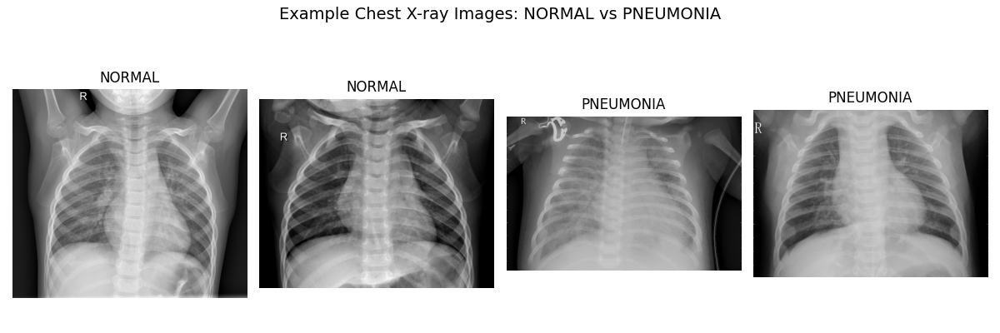
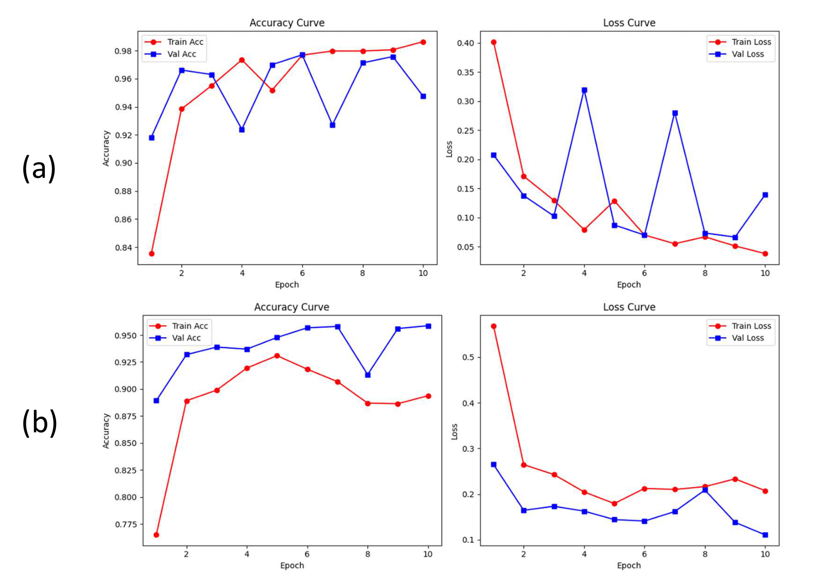
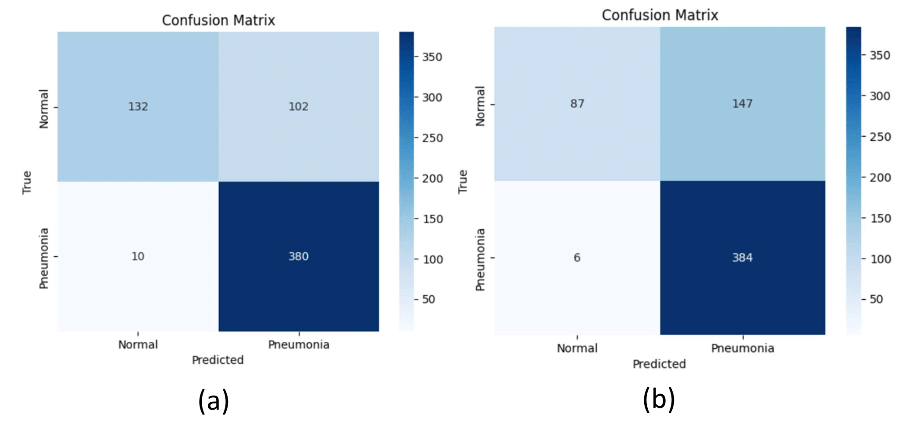
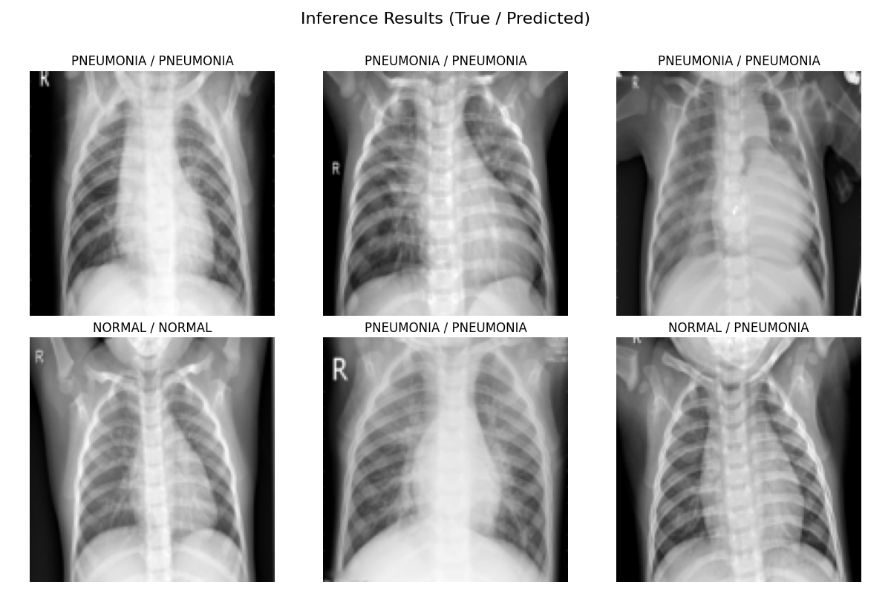

# A-Comparative-Study-between-CNN-and-MLP-Architectures

This repository contains an implementation of a deep learning pipeline for classifying chest X-ray images into **normal** and **pneumonia** categories. Two models are implemented and compared:

- **Convolutional Neural Network (CNN)**
- **Multi-Layer Perceptron (MLP)**

The project is based on the **ChestXray2017** [1] dataset  and includes detailed training, evaluation, and visualization procedures.


---

## 🧠 Models Overview on testset

| Model | Accuracy | Precision | F1-score | Loss  |
|---------|-------------|-------------|-----------|---------|
| CNN  | 0.8205      | 0.7884     | 0.8760   | 0.1153 |
| MLP  | 0.7548      | 0.7232     | 0.8339   | 0.0092 |

---

## 🚀 How to Use

1. **Clone the repository**

```
git clone https://github.com/tnvuhai/A-Comparative-Study-between-CNN-and-MLP-Architectures-In-Chest-X-ray-images.git
cd A-Comparative-Study-between-CNN-and-MLP-Architectures-In-Chest-X-ray-images
```

2. **Run the notebooks**
Use Jupyter Notebook or VS Code to run each pipeline:

- **MLP pipeline:**  
  Open `MLP_pipeline.ipynb` to train and evaluate the MLP model.

- **CNN pipeline:**  
  Open `CNN_pipeline.ipynb` to train and evaluate the CNN model.

## 📊 Results & Visualization
###CNN (a) and MLP (b) performance on training data:



### Confusion Matrices


## Inference


## ✅ Conclusion

The results demonstrate that the CNN model outperforms MLP in both accuracy and F1-score. CNN's ability to extract spatial features from chest X-ray images leads to superior generalization, despite having fewer parameters than the MLP. Meanwhile, MLP showed lower loss but higher misclassification for the "Normal" class, likely due to its inability to capture spatial structure effectively.

Overall, CNN offers a better trade-off between sensitivity and specificity, making it a more reliable option for medical image classification tasks such as pneumonia detection.

## References
[1] D. Kermany, “Labeled optical coherence tomography (OCT) and chest X-Ray images for classification,” 2018. [Online]. Available: www.doi.org/10.17632/rscbjbr9sj.2
